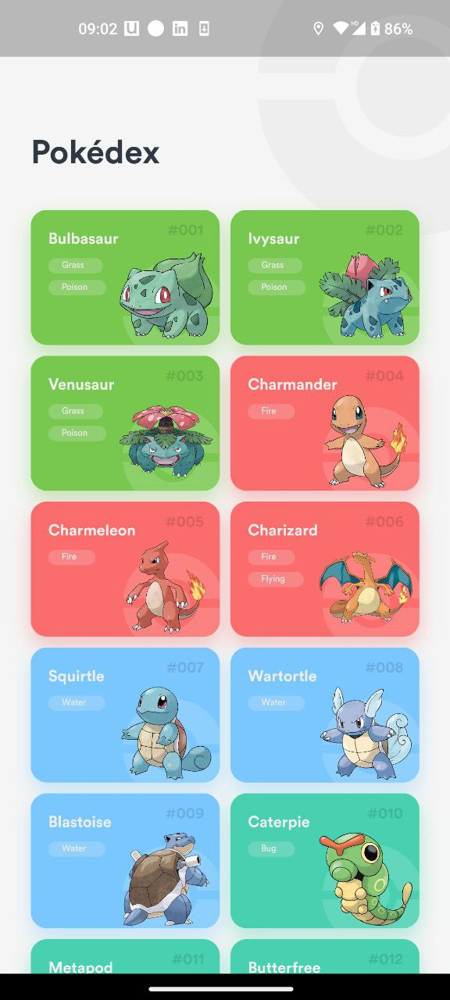
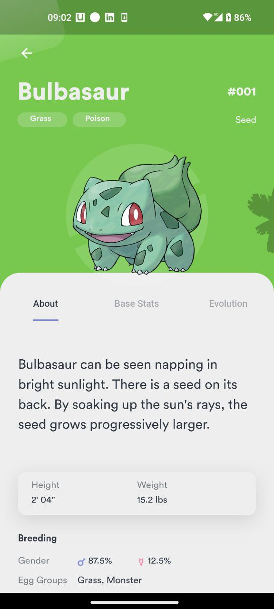
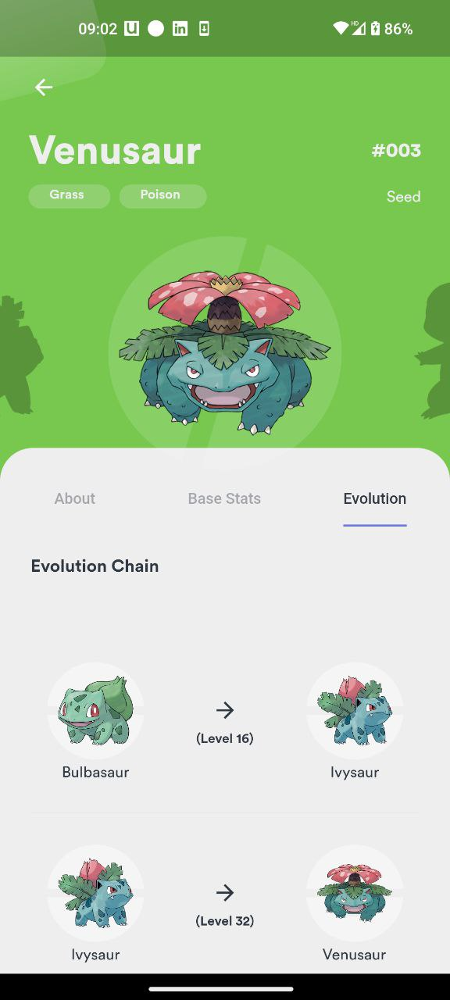

# Pokédex for Gen 1 to Gen 7 Pokémon with Stats & Evolution


## Installing the Application

| Download Universal APK (for Android only)      | To download the Universal APK, [click here](https://github.com/lightlessdays/Pokedex/raw/main/app-release.apk?raw=true)                                                                                                                                                                                                                                            |
|------------------------------------------------|--------------------------------------------------------------------------------------------------------------------------------------------------------------------------------------------------------------------------------------------------------------------------------------------------------------------------------------------------------------------|
| Run through Android Studio (for Android & iOS) | Make sure that you have Flutter installed in your device. Clone this repository on your device and open it in Android Studio. Next, connect your device or emulator with Android Studio. Then simly run the command ```flutter pub get``` to get all the dependencies of the project. After that, run ```flutter run``` to install the application in your device. |

## 📱 Screenshots

  

  

## Contributing

We welcome contributions from the community to help improve Pokedex. To contribute, please follow these guidelines:

- Fork this repository.
- Create a new branch for your feature or bug fix: `git checkout -b feature/your-feature-name`
- Make your changes and commit them: `git commit -m "Description of your changes"`
- Push your changes to your fork: `git push origin feature/your-feature-name`
- Open a pull request to the `main` branch of this repository.

For more detailed information on contributing, please read our [Contributing Guidelines](CONTRIBUTING.md).

## Code of Conduct

We want to ensure a welcoming and inclusive community around Pokedex. We have a [Code of Conduct](CODE_OF_CONDUCT.md) in place to set the expectations for respectful and collaborative behavior. Please read and adhere to it when participating in this project.

## 🪪 License

MIT License

Copyright (c) 2023 Dhruv Badaya

Permission is hereby granted, free of charge, to any person obtaining a copy
of this software and associated documentation files (the "Software"), to deal
in the Software without restriction, including without limitation the rights
to use, copy, modify, merge, publish, distribute, sublicense, and/or sell
copies of the Software, and to permit persons to whom the Software is
furnished to do so, subject to the following conditions:

The above copyright notice and this permission notice shall be included in all
copies or substantial portions of the Software.

THE SOFTWARE IS PROVIDED "AS IS", WITHOUT WARRANTY OF ANY KIND, EXPRESS OR
IMPLIED, INCLUDING BUT NOT LIMITED TO THE WARRANTIES OF MERCHANTABILITY,
FITNESS FOR A PARTICULAR PURPOSE AND NONINFRINGEMENT. IN NO EVENT SHALL THE
AUTHORS OR COPYRIGHT HOLDERS BE LIABLE FOR ANY CLAIM, DAMAGES OR OTHER
LIABILITY, WHETHER IN AN ACTION OF CONTRACT, TORT OR OTHERWISE, ARISING FROM,
OUT OF OR IN CONNECTION WITH THE SOFTWARE OR THE USE OR OTHER DEALINGS IN THE
SOFTWARE.

## Contact

If you have any questions, suggestions, or need assistance, please contact us at [dhruvbadaya@gmail.com](mailto:dhruvbadaya@gmail.com).

Thank you for contributing to Pokedex!
